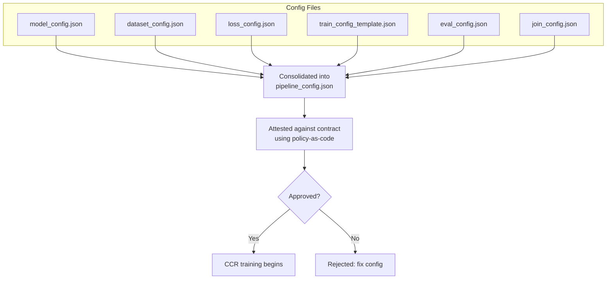

# COVID-19 Predictive Modelling

## Scenario Type

| Scenario name | Scenario type | Task type | Privacy | No. of TDPs* | Data type (format) | Model type (format) | Join type (No. of datasets) |
|--------------|---------------|-----------------|--------------|-----------|------------|------------|------------|
| COVID-19 | Training - Deep Learning | Binary Classification | Differentially Private | 3 | PII tabular data (CSV) | MLP (ONNX) | Horizontal (3)|

---

## Scenario Description

This hypothetical scenario involves three Training Data Providers (TDPs), ICMR (providing Covid test results), COWIN (providing vaccine data) and a State War Room ("Index") (providing patient records), and a Training Data Consumer (TDC) who wishes the train a model for predicting Covid infection using these datasets. The model and datasets are for illustrative purposes only; none of these organizations have been involved in contributing to the code or datasets. The data used in this scenario is not real or representative of any actual data, and has been synthetically generated.

The end-to-end training pipeline consists of the following phases:

1. Data pre-processing and de-identification
2. Data packaging, encryption and upload
3. Model packaging, encryption and upload
4. Encryption key import with key release policies
5. Deployment and execution of CCR
6. Trained model decryption

## Build container images

Build container images required for this sample as follows:

```bash
export SCENARIO=covid
export REPO_ROOT="$(git rev-parse --show-toplevel)"
cd $REPO_ROOT/scenarios/$SCENARIO
./ci/build.sh
```

This script builds the following container images:

- ```preprocess-icmr, preprocess-cowin, preprocess-index```: Containers that pre-process and de-identify datasets.
- ```ccr-model-save```: Container that saves the model to be trained in ONNX format.

Alternatively, you can pull and use pre-built container images from the iSPIRT container registry by setting the following environment variable. Docker hub has started throttling which may affect the upload/download time, especially when images are bigger size. So, It is advisable to use other container registries. We are using Azure container registry (ACR) as shown below:

```bash
export CONTAINER_REGISTRY=ispirt.azurecr.io
cd $REPO_ROOT/scenarios/$SCENARIO
./ci/build.sh
```

## Data pre-processing and de-identification

The folder ```scenarios/covid/src``` contains scripts for pre-processing and de-identifying sample COVID-19 datasets. Acting as a Training Data Provider (TDP), prepare your datasets:

```bash
cd $REPO_ROOT/scenarios/$SCENARIO/deployment/local
./preprocess.sh
```

The datasets are saved to the [data](./data/) directory.

## Prepare model for training

Next, acting as a Training Data Consumer (TDC), define and save your base model for training using the following script. This calls the [save_base_model.py](./src/save_base_model.py) script, which is a custom script that saves the model to the [models](./modeller/models) directory, as an ONNX file:

```bash
./save-model.sh
```

## Deploy locally

Assuming you have cleartext access to all the de-identified datasets, you can train the model as follows:

```bash
./train.sh
```

The script joins the datasets and trains the model using a pipeline configuration. To modify the various components of the training pipeline, you can edit the training config files in the [config](./config/) directory. The training config files are used to create the pipeline configuration ([pipeline_config.json](./config/pipeline_config.json)) created by consolidating all the TDC's training config files, namely the [model config](./config/model_config.json), [dataset config](./config/dataset_config.json), [loss function config](./config/loss_config.json), [training config](./config/train_config_template.json), [evaluation config](./config/eval_config.json), and if multiple datasets are used, the [data join config](./config/join_config.json). These enable the TDC to design highly customized training pipelines without requiring review and approval of new custom code for each use case — reducing risks from potentially malicious or non-compliant code. The consolidated pipeline configuration is then attested against the signed contract using the TDP's policy-as-code. If approved, it is executed in the CCR to train the model, which we will deploy in the next section.



Note: A few model config variants for training can be found [here](./config/sample_variants).

If all goes well, you should see output similar to the following output, and the trained model and evaluation metrics will be saved under the folder [output](./modeller/output).

```
train-1  | Generating aggregated data in /tmp/covid_joined.csv
train-1  | Training samples: 1483
train-1  | Validation samples: 424
train-1  | Test samples: 212
train-1  | Dataset constructed from config
train-1  | Model loaded from ONNX file
train-1  | Created non-private baseline model for comparison
train-1  | Optimizer SGD loaded from config
train-1  | Custom loss function loaded from config
train-1  | Epoch 1/5 completed | Training Loss: 0.6092 | Epsilon: 0.3496
train-1  | Epoch 1/5 completed | Validation Loss: 0.7853
train-1  | Epoch 2/5 completed | Training Loss: 0.8024 | Epsilon: 0.6328
train-1  | Epoch 2/5 completed | Validation Loss: 0.7784
train-1  | Epoch 3/5 completed | Training Loss: 0.6584 | Epsilon: 0.8921
train-1  | Epoch 3/5 completed | Validation Loss: 0.6838
train-1  | Epoch 4/5 completed | Training Loss: 0.6794 | Epsilon: 1.2342
train-1  | Epoch 4/5 completed | Validation Loss: 0.6140
train-1  | Epoch 5/5 completed | Training Loss: 0.5554 | Epsilon: 1.4947
train-1  | Epoch 5/5 completed | Validation Loss: 0.6091
train-1  | Non-private baseline model - Epoch 1/5 completed | Training Loss: 0.4564
train-1  | Non-private baseline model - Epoch 1/5 completed | Validation Loss: 0.6719
train-1  | Non-private baseline model - Epoch 2/5 completed | Training Loss: 0.5467
train-1  | Non-private baseline model - Epoch 2/5 completed | Validation Loss: 0.6719
train-1  | Non-private baseline model - Epoch 3/5 completed | Training Loss: 0.4356
train-1  | Non-private baseline model - Epoch 3/5 completed | Validation Loss: 0.6719
train-1  | Non-private baseline model - Epoch 4/5 completed | Training Loss: 0.3814
train-1  | Non-private baseline model - Epoch 4/5 completed | Validation Loss: 0.6719
train-1  | Non-private baseline model - Epoch 5/5 completed | Training Loss: 0.3352
train-1  | Non-private baseline model - Epoch 5/5 completed | Validation Loss: 0.4864
train-1  | Saving trained model to /mnt/remote/output/trained_model.onnx
train-1  | Evaluation Metrics: {'test_loss': 0.6747791530951014, 'accuracy': 0.6415094339622641, 'f1_score': 0.5365853658536586, 'roc_auc': 0.6637159032424087}
train-1  | CCR Training complete!
train-1  |
train-1 exited with code 0
```

The trained model along with sample predictions on the validation set will be saved under the [output](./modeller/output/) directory.

Now that training has run successfully locally, let's move on to the actual execution using a Confidential Clean Room (CCR) equipped with confidential computing, key release policies, and contract-based access control.

## Deploy on CCR

In a more realistic scenario, these datasets will not be available in the clear to the TDC, and the TDC will be required to use a CCR for training her model. The following steps describe the process of sharing encrypted datasets with TDCs and setting up a CCR in Azure for training models. Please stay tuned for CCR on other cloud platforms.

To deploy in Azure, you will need the following.

- Docker Hub account to store container images. Alternatively, you can use pre-built images from the ```iSPIRT``` container registry.
- [Azure Key Vault](https://azure.microsoft.com/en-us/products/key-vault/) to store encryption keys and implement secure key release to CCR. You can either use Azure Key Vault Premium (lower cost), or [Azure Key Vault managed HSM](https://learn.microsoft.com/en-us/azure/key-vault/managed-hsm/overview) for enhanced security. Please see instructions below on how to create and set up your AKV instance.
- Valid Azure subscription with sufficient access to create key vault, storage accounts, storage containers, and Azure Container Instances (ACI).

If you are using your own development environment instead of a dev container or codespaces, you will need to install the following dependencies.

- [Azure CLI](https://learn.microsoft.com/en-us/cli/azure/install-azure-cli-linux).  
- [Azure CLI Confidential containers extension](https://learn.microsoft.com/en-us/cli/azure/confcom?view=azure-cli-latest). After installing Azure CLI, you can install this extension using ```az extension add --name confcom -y```
- [Go](https://go.dev/doc/install). Follow the instructions to install Go. After installing, ensure that the PATH environment variable is set to include ```go``` runtime.
- ```jq```. You can install jq using ```sudo apt-get install -y jq```

We will be creating the following resources as part of the deployment.

- Azure Key Vault
- Azure Storage account
- Storage containers to host encrypted datasets
- Azure Container Instances (ACI) to deploy the CCR and train the model

### 1\. Push Container Images

Pre-built container images are available in iSPIRT's container registry, which can be pulled by setting the following environment variable.

```bash
export CONTAINER_REGISTRY=ispirt.azurecr.io
```

If you wish to use your own container images, login to docker hub (or your container registry of choice) and then build and push the container images to it, so that they can be pulled by the CCR. This is a one-time operation, and you can skip this step if you have already pushed the images to your container registry.

```bash
export CONTAINER_REGISTRY=<container-registry-name>
docker login -u <docker-hub-username> -p <docker-hub-password> ${CONTAINER_REGISTRY}
cd $REPO_ROOT
./ci/push-containers.sh
cd $REPO_ROOT/scenarios/$SCENARIO
./ci/push-containers.sh
```

> **Note:** Replace `<container-registry-name>`, `<docker-hub-username>` and `<docker-hub-password>` with your container registry name, docker hub username and password respectively. Preferably use registry services other than Docker Hub as throttling restrictions will cause delays (or) image push/pull failures.

---

### 2\. Create Resources

First, set up the necessary environment variables for your deployment.

Option 1: Manually set the environment variables.

```bash
az login

export SCENARIO=covid
export CONTAINER_REGISTRY=ispirt.azurecr.io
export AZURE_LOCATION=northeurope
export AZURE_SUBSCRIPTION_ID=<azure-subscription-id>
export AZURE_RESOURCE_GROUP=<resource-group-name>
export AZURE_KEYVAULT_ENDPOINT=<key-vault-name>.vault.azure.net
export AZURE_STORAGE_ACCOUNT_NAME=<storage-account-name>

export AZURE_ICMR_CONTAINER_NAME=icmrcontainer
export AZURE_COWIN_CONTAINER_NAME=cowincontainer
export AZURE_INDEX_CONTAINER_NAME=indexcontainer
export AZURE_MODEL_CONTAINER_NAME=modelcontainer
export AZURE_OUTPUT_CONTAINER_NAME=outputcontainer
```

Option 2: Configurable script to set the environment variables.

Alternatively, you can edit the values in the [export-variables.sh](./export-variables.sh) script and run it to set the environment variables.

```bash
./export-variables.sh
source export-variables.sh
```

Azure Naming Rules:
- Resource Group:
  - 1–90 characters
  - Letters, numbers, underscores, parentheses, hyphens, periods allowed
  - Cannot end with a period (.)
  - Case-insensitive, unique within subscription\
- Key Vault:
  - 3-24 characters
  - Globally unique name
  - Lowercase letters, numbers, hyphens only
  - Must start and end with letter or number
- Storage Account:
  - 3-24 characters
  - Globally unique name
  - Lowercase letters and numbers only
- Storage Container:
  - 3-63 characters
  - Lowercase letters, numbers, hyphens only
  - Must start and end with a letter or number
  - No consecutive hyphens
  - Unique within storage account

---

**Important:**

The values for the environment variables listed below must precisely match the namesake environment variables used during contract signing (next step). Any mismatch will lead to execution failure.

-  `SCENARIO`
- `AZURE_KEYVAULT_ENDPOINT`
- `CONTRACT_SERVICE_URL`
- `AZURE_STORAGE_ACCOUNT_NAME`
- `AZURE_ICMR_CONTAINER_NAME`
- `AZURE_COWIN_CONTAINER_NAME`
- `AZURE_INDEX_CONTAINER_NAME`

---
With the environment variables set, we are ready to create the resources -- Azure Key Vault and Azure Storage containers.

```bash
cd $REPO_ROOT/scenarios/$SCENARIO/deployment/azure
./1-create-storage-containers.sh
./2-create-akv.sh
```
---

### 3\. Contract Signing

Navigate to the [contract-ledger](https://github.com/kapilvgit/contract-ledger/blob/main/README.md) repository and follow the instructions for contract signing.

Once the contract is signed, export the contract sequence number as an environment variable in the same terminal where you set the environment variables for the deployment.

```bash
export CONTRACT_SEQ_NO=<contract-sequence-number>
```

---

### 4\. Data Encryption and Upload

Using their respective keys, the TDPs and TDC encrypt their datasets and models (respectively) and upload them to the Storage containers created in the previous step.

Navigate to the [Azure deployment](./deployment/azure/) directory and execute the scripts for key import, data encryption and upload to Azure Blob Storage, in preparation of the CCR deployment.

The import-keys script generates and imports encryption keys into Azure Key Vault with a policy based on [policy-in-template.json](./policy/policy-in-template.json). The policy requires that the CCRs run specific containers with a specific configuration which includes the public identity of the contract service. Only CCRs that satisfy this policy will be granted access to the encryption keys. The generated keys are available as files with the extension `.bin`.

```bash
export CONTRACT_SERVICE_URL=https://depa-training-contract-service.centralindia.cloudapp.azure.com:8000
export TOOLS_HOME=$REPO_ROOT/external/confidential-sidecar-containers/tools

./3-import-keys.sh
```

The data and model are then packaged as encrypted filesystems by the TDPs and TDC using their respective keys, which are saved as `.img` files.

```bash
./4-encrypt-data.sh
```

The encrypted data and model are then uploaded to the Storage containers created in the previous step. The `.img` files are uploaded to the Storage containers as blobs.

```bash
./5-upload-encrypted-data.sh
```

---

### 5\. CCR Deployment

With the resources ready, we are ready to deploy the Confidential Clean Room (CCR) for executing the privacy-preserving model training.

```bash
export CONTRACT_SEQ_NO=<contract-sequence-number>
./deploy.sh -c $CONTRACT_SEQ_NO -p ../../config/pipeline_config.json
```

Set the `$CONTRACT_SEQ_NO` variable to the exact value of the contract sequence number (of format 2.XX). For example, if the number was 2.15, export as:

```bash
export CONTRACT_SEQ_NO=15
```

This script will deploy the container images from your container registry, including the encrypted filesystem sidecar. The sidecar will generate an SEV-SNP attestation report, generate an attestation token using the Microsoft Azure Attestation (MAA) service, retrieve dataset, model and output encryption keys from the TDP and TDC's Azure Key Vault, train the model, and save the resulting model into TDC's output filesystem image, which the TDC can later decrypt.

<!-- **Note:** if the contract-ledger repository is also located at the root of the same environment where this depa-training repo is, the `$CONTRACT_SEQ_NO` variable automatically picks up the sequence number of the latest contract that was signed between the TDPs and TDC. -->

**Note:** The completion of this script's execution simply creates a CCR instance, and doesn't indicate whether training has completed or not. The training process might still be ongoing. Poll the container logs (see below) to track progress until training is complete.

### 6\. Monitor Container Logs

Use the following commands to monitor the logs of the deployed containers. You might have to repeatedly poll this command to monitor the training progress:

```bash
az container logs \
  --name "depa-training-$SCENARIO" \
  --resource-group "$AZURE_RESOURCE_GROUP" \
  --container-name depa-training
```

You will know training has completed when the logs print "CCR Training complete!".

#### Troubleshooting

In case training fails, you might want to monitor the logs of the encrypted storage sidecar container to see if the encryption process completed successfully:

```bash
az container logs --name depa-training-$SCENARIO --resource-group $AZURE_RESOURCE_GROUP --container-name encrypted-storage-sidecar
```

And to further debug, inspect the logs of the encrypted filesystem sidecar container:

```bash
az container exec \
  --resource-group $AZURE_RESOURCE_GROUP \
  --name depa-training-$SCENARIO \
  --container-name encrypted-storage-sidecar \
  --exec-command "/bin/sh"
```

Once inside the sidecar container shell, view the logs:

```bash
cat log.txt
```
Or inspect the individual mounted directories in `mnt/remote/`:

```bash
cd mnt/remote && ls
```

### 6\. Download and Decrypt Model

Once training has completed successfully (The training container logs will mention it explicitly), download and decrypt the trained model and other training outputs.

```bash
./6-download-decrypt-model.sh
```

The outputs will be saved to the [output](./modeller/output/) directory.

To check if the trained model is fresh, you can run the following command:

```bash
stat $REPO_ROOT/scenarios/$SCENARIO/modeller/output/trained_model.onnx
```

---
### Clean-up

You can use the following command to delete the resource group and clean-up all resources used in the demo. Alternatively, you can navigate to the Azure portal and delete the resource group created for this demo.

```bash
az group delete --yes --name $AZURE_RESOURCE_GROUP
```